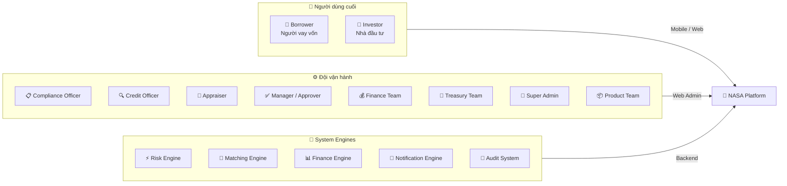
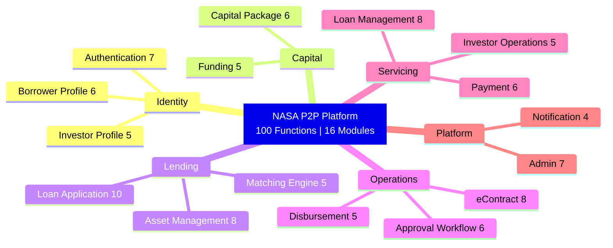
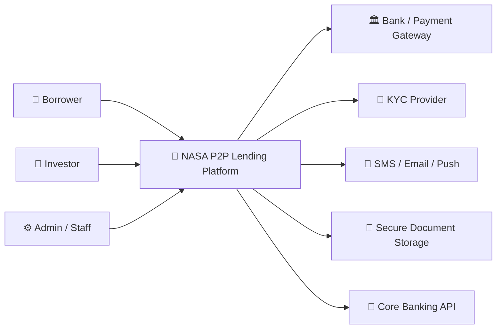
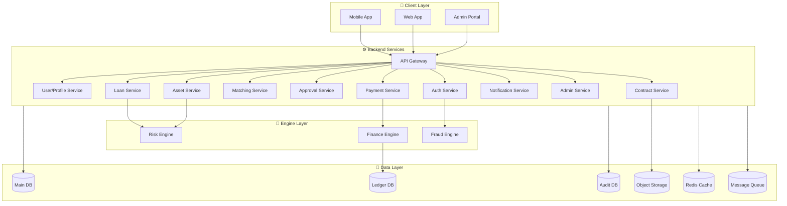
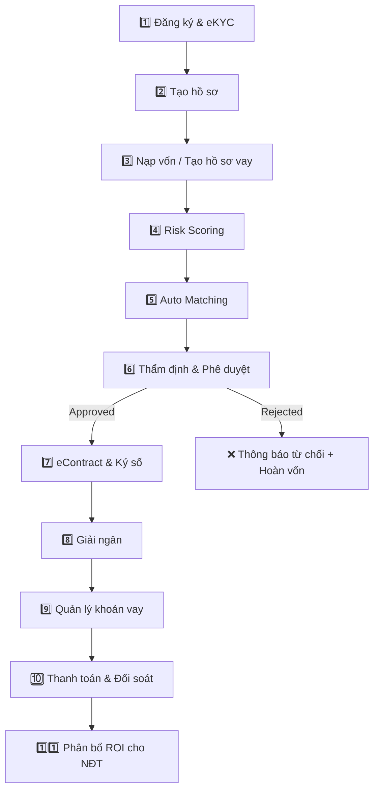
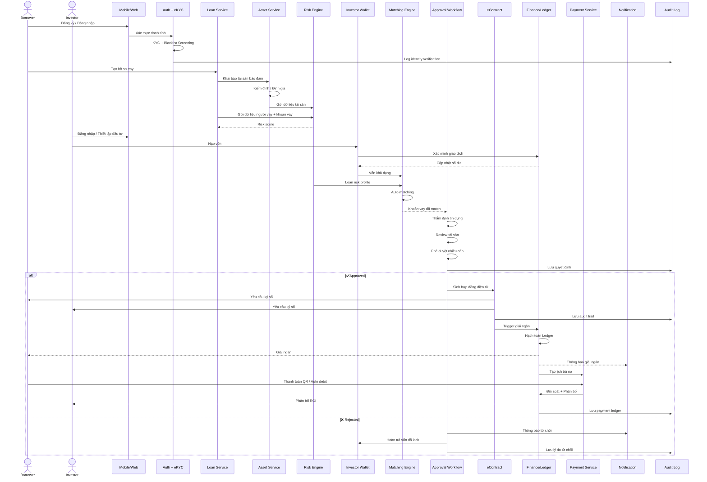
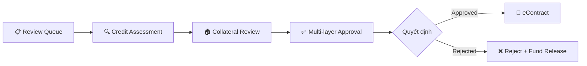
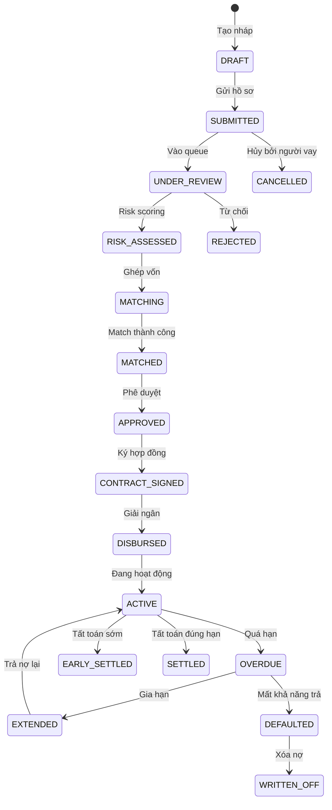
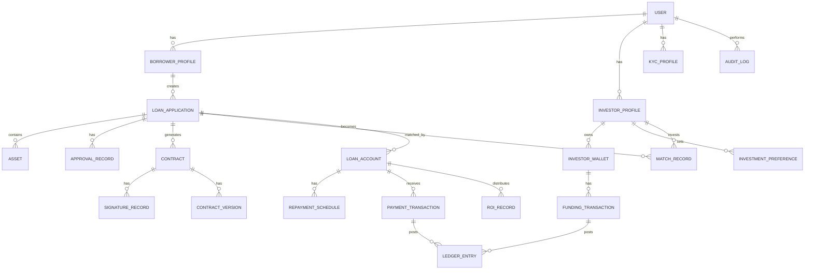
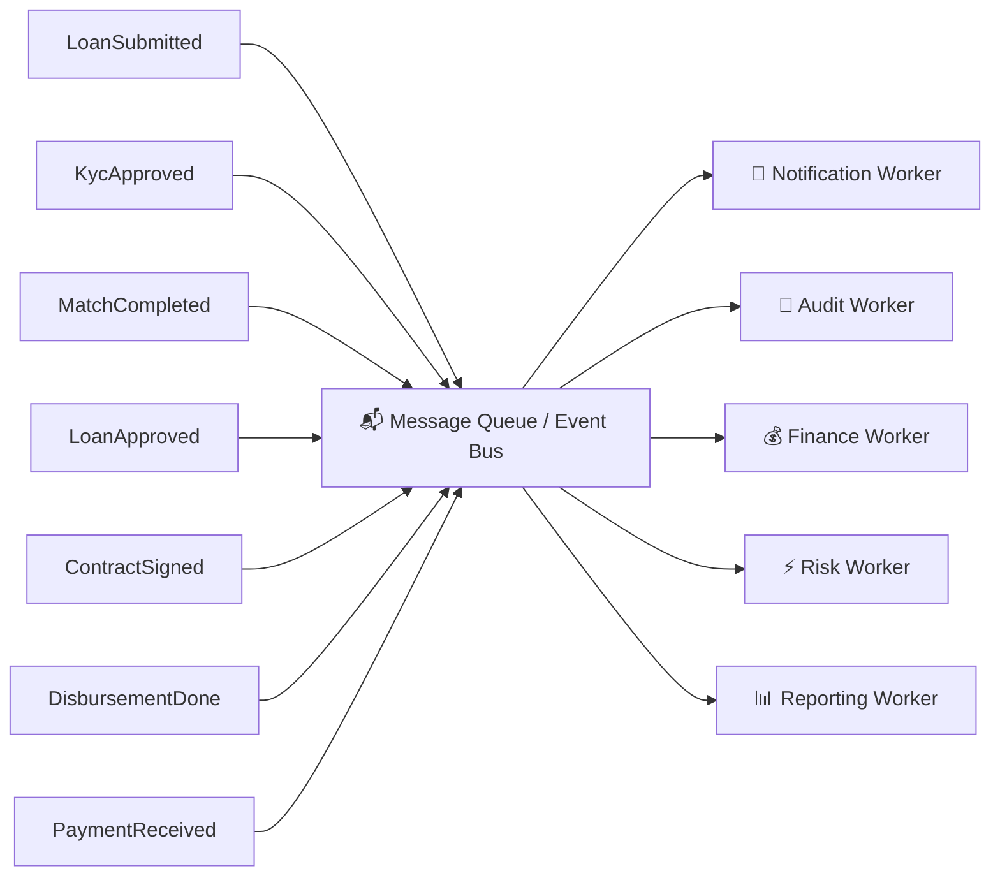

# 🏦 NASA SUPER APP — P2P LENDING PLATFORM

> **Tài liệu giới thiệu tổng thể hệ thống P2P Lending**
> Phiên bản: MVP Phase 1 | Ngày: Tháng 06/2026
> Tài liệu mật — Chỉ dành cho đối tác và khách hàng được ủy quyền.

---

## 📋 Mục lục

1. [Tổng quan giải pháp](#1-tổng-quan-giải-pháp)
2. [Giá trị cốt lõi](#2-giá-trị-cốt-lõi)
3. [Các bên tham gia hệ thống](#3-các-bên-tham-gia-hệ-thống)
4. [Bản đồ chức năng — Function Map](#4-bản-đồ-chức-năng--function-map)
5. [Kiến trúc tổng thể hệ thống](#5-kiến-trúc-tổng-thể-hệ-thống)
6. [Luồng nghiệp vụ End-to-End](#6-luồng-nghiệp-vụ-end-to-end)
7. [Chi tiết từng module nghiệp vụ](#7-chi-tiết-từng-module-nghiệp-vụ)
8. [Kiến trúc kỹ thuật](#8-kiến-trúc-kỹ-thuật)
9. [Bảo mật & Compliance](#9-bảo-mật--compliance)
10. [Lộ trình triển khai](#10-lộ-trình-triển-khai)

---

## 1. Tổng quan giải pháp

**NASA Super App** là nền tảng P2P Lending / Investment Lending thế hệ mới, kết nối trực tiếp **Người vay vốn (Borrower)** với **Nhà đầu tư (Investor)** thông qua hệ thống tự động hóa toàn diện.

### 🎯 Sứ mệnh

Xây dựng nền tảng tài chính số **minh bạch, an toàn và hiệu quả**, giúp:
- Người vay tiếp cận vốn nhanh chóng với lãi suất cạnh tranh
- Nhà đầu tư tối ưu hóa lợi nhuận với rủi ro được kiểm soát
- Đội vận hành quản trị toàn diện với công cụ tự động hóa

### 🔑 Phạm vi hệ thống MVP Phase 1

| Hạng mục | Số lượng |
|---|---|
| Tổng số chức năng (Functions) | **100 functions** |
| Số module nghiệp vụ | **16 modules** |
| Số tác nhân hệ thống | **15 actors** |
| Nền tảng hỗ trợ | Mobile App, Web App, Web Admin Portal |
| Engines tự động | Risk, Matching, Finance, Notification, Audit |

---

## 2. Giá trị cốt lõi

### 💡 Đối với Người vay (Borrower)

| Giá trị | Mô tả |
|---|---|
| ⚡ Nhanh chóng | Đăng ký, KYC, tạo hồ sơ vay hoàn toàn online trên Mobile |
| 🔒 An toàn | eKYC xác minh CCCD + Face Matching + Liveness Detection |
| 📊 Minh bạch | Theo dõi trạng thái hồ sơ, lịch trả nợ, lãi suất realtime |
| 💰 Linh hoạt | Nhiều sản phẩm vay, hỗ trợ tất toán trước hạn, gia hạn |

### 💡 Đối với Nhà đầu tư (Investor)

| Giá trị | Mô tả |
|---|---|
| 📈 Tối ưu ROI | 4 gói vốn (PA1–PA4) với mức lợi tức và rủi ro khác nhau |
| 🎯 Cá nhân hóa | Thiết lập khẩu vị rủi ro, điều kiện đầu tư, tự động matching |
| 🛡️ Kiểm soát rủi ro | Risk scoring tự động, tài sản bảo đảm, multi-layer approval |
| 📱 Tiện lợi | Quản lý danh mục, ROI, rút vốn, tái đầu tư trên Mobile |

### 💡 Đối với Đội vận hành (Admin/Staff)

| Giá trị | Mô tả |
|---|---|
| 🤖 Tự động hóa | Auto matching, auto scoring, auto reconciliation |
| 📋 Kiểm soát | Multi-layer approval, RBAC, immutable audit log |
| 📊 Dashboard | Fraud monitoring, treasury dashboard, liquidity overview |
| ⚙️ Cấu hình linh hoạt | Dynamic product, ROI config, system parameters |

---

## 3. Các bên tham gia hệ thống

### Chi tiết vai trò

| # | Tác nhân | Vai trò chính | Kênh |
|---|---|---|---|
| 1 | **Borrower** | Đăng ký, KYC, tạo hồ sơ vay, khai báo tài sản, ký hợp đồng, nhận giải ngân, trả nợ | Mobile / Web |
| 2 | **Investor** | Đăng ký, xác minh, nạp vốn, chọn khẩu vị đầu tư, theo dõi danh mục và ROI | Mobile / Web |
| 3 | **Compliance Officer** | Kiểm tra KYC, blacklist, pháp lý, audit, fraud | Web Admin |
| 4 | **Credit Officer** | Thẩm định tín dụng, đánh giá năng lực trả nợ | Web Admin |
| 5 | **Appraiser** | Kiểm định, định giá, xác minh tài sản bảo đảm | Web Admin / Mobile |
| 6 | **Manager / Approver** | Phê duyệt nhiều cấp, quyết định duyệt / từ chối | Web Admin |
| 7 | **Finance Team** | Xác minh nạp tiền, giải ngân, đối soát thanh toán | Web Admin |
| 8 | **Treasury Team** | Quản lý gói vốn, quota, liquidity, dòng tiền | Web Admin |
| 9 | **Super Admin** | Quản trị người dùng, phân quyền, cấu hình hệ thống | Web Admin |
| 10 | **Product Team** | Cấu hình sản phẩm vay, gói vốn, ROI | Web Admin |
| 11 | **Risk Engine** | Chấm điểm rủi ro người vay, tài sản, khoản vay | Backend Auto |
| 12 | **Matching Engine** | Tự động ghép khoản vay với nguồn vốn nhà đầu tư | Backend Auto |
| 13 | **Finance Engine** | Tính lãi, phí phạt, ledger, phân bổ dòng tiền, ROI | Backend Auto |
| 14 | **Notification Engine** | Push notification, SMS, email, reminder | Backend Auto |
| 15 | **Audit System** | Ghi nhận nhật ký bất biến toàn bộ thao tác quan trọng | Backend Auto |

---

## 4. Bản đồ chức năng — Function Map

### 4.1 Tổng quan Module

### 4.2 Chi tiết Function List theo Module

#### 🔐 Module 1: Authentication & Identity (7 functions)

| ID | Function | Mô tả | Actor | Priority | Platform |
|---|---|---|---|---|---|
| AUTH-001 | Register Account | Đăng ký tài khoản với OTP verification | Borrower / Investor | High | Mobile/Web |
| AUTH-002 | Login System | Đăng nhập hệ thống JWT/Auth Session | All User | High | Mobile/Web |
| AUTH-003 | KYC Verification | Xác minh CCCD bằng OCR + Face Matching | Borrower / Investor | **Critical** | Mobile |
| AUTH-004 | NasID Generation | Sinh mã định danh duy nhất (Unified Identity) | System | High | Backend |
| AUTH-005 | Device Binding | Liên kết thiết bị — Anti Fraud | User | Medium | Mobile |
| AUTH-006 | eKYC Review Queue | Danh sách hồ sơ KYC cần kiểm tra thủ công | Compliance/Admin | High | Web Admin |
| AUTH-007 | Blacklist Screening | Kiểm tra blacklist AML/Fraud | System | **Critical** | Backend |

#### 🧑 Module 2: Borrower Profile (6 functions)

| ID | Function | Mô tả | Actor | Priority | Platform |
|---|---|---|---|---|---|
| BOR-001 | Borrower Profile Management | Quản lý hồ sơ người vay (CRUD) | Borrower | High | Mobile/Web |
| BOR-002 | Employment Information | Thông tin nghề nghiệp, salary validation | Borrower | Medium | Mobile |
| BOR-003 | Income Declaration | Khai báo thu nhập + upload bằng chứng | Borrower | High | Mobile |
| BOR-004 | Bank Account Binding | Liên kết tài khoản ngân hàng (bank verification) | Borrower | **Critical** | Mobile |
| BOR-005 | Financial Health Score | Chấm điểm tài chính (Future AI scoring) | System | Medium | Backend |
| BOR-006 | Borrower Risk Rating | Xếp hạng rủi ro người vay (Auto scoring) | Risk Engine | High | Backend |

#### 💼 Module 3: Investor Profile (5 functions)

| ID | Function | Mô tả | Actor | Priority | Platform |
|---|---|---|---|---|---|
| INV-001 | Investor Profile Management | Quản lý hồ sơ nhà đầu tư (Onboarding) | Investor | High | Mobile/Web |
| INV-002 | Investor Risk Appetite | Thiết lập khẩu vị rủi ro (Low/Medium/High) | Investor | High | Mobile |
| INV-003 | Investment Preference | Thiết lập điều kiện đầu tư (Auto matching) | Investor | **Critical** | Mobile/Web |
| INV-004 | Investor Wallet | Ví đầu tư (Funding wallet) | Investor | **Critical** | Mobile/Web |
| INV-005 | Investor Verification | Xác minh nhà đầu tư KYC/KYB | Compliance | High | Web Admin |

#### 🏦 Module 4: Capital Package (6 functions)

| ID | Function | Mô tả | Actor | Priority | Platform |
|---|---|---|---|---|---|
| CAP-001 | PA1 Package — Fixed Return | Gói vốn lợi tức cố định | Treasury/Admin | High | Web Admin |
| CAP-002 | PA2 Package — Flexible Model | Gói vốn linh hoạt theo khoản vay | Treasury/Admin | High | Web Admin |
| CAP-003 | PA3 Package — Revenue Share | Gói vốn chia sẻ doanh thu | Treasury/Admin | High | Web Admin |
| CAP-004 | PA4 Package — Asset-backed | Gói vốn có tài sản bảo đảm | Treasury/Admin | High | Web Admin |
| CAP-005 | Package ROI Configuration | Cấu hình lợi tức (Dynamic ROI) | Finance Admin | **Critical** | Web Admin |
| CAP-006 | Package Quota Management | Quản lý hạn mức gói vốn (Max capacity) | Treasury | High | Web Admin |

#### 💵 Module 5: Funding (5 functions)

| ID | Function | Mô tả | Actor | Priority | Platform |
|---|---|---|---|---|---|
| FND-001 | Deposit Funding | Nhà đầu tư nạp vốn (Bank transfer) | Investor | **Critical** | Mobile/Web |
| FND-002 | Funding Verification | Xác minh giao dịch nạp tiền (Auto reconcile) | Finance/Admin | High | Web Admin |
| FND-003 | Funding Wallet Balance | Xem số dư ví đầu tư (Real-time) | Investor | High | Mobile |
| FND-004 | Fund Locking | Khóa vốn khi match khoản vay (Prevent oversell) | System | **Critical** | Backend |
| FND-005 | Fund Release | Hoàn trả vốn nếu fail (Auto release) | System | High | Backend |

#### 📝 Module 6: Loan Application (10 functions)

| ID | Function | Mô tả | Actor | Priority | Platform |
|---|---|---|---|---|---|
| LOAN-001 | Create Loan Application | Tạo hồ sơ vay mới | Borrower | **Critical** | Mobile |
| LOAN-002 | Loan Product Selection | Chọn sản phẩm vay (Dynamic packages) | Borrower | High | Mobile |
| LOAN-003 | Loan Amount Declaration | Khai báo số tiền vay (Min/Max validation) | Borrower | **Critical** | Mobile |
| LOAN-004 | Loan Purpose Declaration | Khai báo mục đích vay (Risk scoring) | Borrower | Medium | Mobile |
| LOAN-005 | Upload Supporting Documents | Upload hồ sơ giấy tờ (OCR supported) | Borrower | High | Mobile |
| LOAN-006 | Asset Declaration | Khai báo tài sản thế chấp (Multi asset) | Borrower | **Critical** | Mobile |
| LOAN-007 | Loan Draft Saving | Lưu nháp hồ sơ vay (Resume later) | Borrower | Medium | Mobile |
| LOAN-008 | Loan Submission | Gửi hồ sơ vay (Trigger workflow) | Borrower | **Critical** | Mobile |
| LOAN-009 | Loan Status Tracking | Theo dõi trạng thái hồ sơ (Timeline) | Borrower | High | Mobile |
| LOAN-010 | Loan Withdrawal Request | Yêu cầu rút tiền sau khi duyệt (Trigger disbursement) | Borrower | **Critical** | Mobile/Web |

#### 🏠 Module 7: Asset Management (8 functions)

| ID | Function | Mô tả | Actor | Priority | Platform |
|---|---|---|---|---|---|
| AST-001 | Asset Intake | Tiếp nhận tài sản (Asset registry) | Staff/Appraiser | **Critical** | Web/Mobile |
| AST-002 | Asset Verification | Kiểm định tài sản (Anti fraud) | Appraiser | **Critical** | Web |
| AST-003 | Multi-layer Valuation | Định giá tài sản đa lớp (Multiple valuator) | Appraiser | **Critical** | Web |
| AST-004 | Asset Evidence Storage | Lưu bằng chứng tài sản (Secure storage) | System | High | Backend |
| AST-005 | Ownership Validation | Xác minh quyền sở hữu (Legal check) | Staff | **Critical** | Web |
| AST-006 | Asset Risk Rating | Chấm điểm rủi ro tài sản (Liquidity scoring) | Risk Engine | High | Backend |
| AST-007 | Asset Revaluation | Định giá lại tài sản (Periodic review) | Appraiser | Medium | Web |
| AST-008 | Collateral Registry | Danh sách TSĐB (Searchable) | Admin | High | Web Admin |

#### 🔄 Module 8: Matching Engine (5 functions)

| ID | Function | Mô tả | Actor | Priority | Platform |
|---|---|---|---|---|---|
| MTC-001 | Investor Criteria Setup | Thiết lập điều kiện đầu tư (Auto matching) | Investor | **Critical** | Mobile/Web |
| MTC-002 | Auto Loan Matching | Tự động match khoản vay (Matching engine) | System | **Critical** | Backend |
| MTC-003 | Risk-based Matching | Match theo risk profile (Risk alignment) | System | High | Backend |
| MTC-004 | Match Notification | Thông báo match thành công (Push) | System | High | Mobile |
| MTC-005 | Manual Match Review | Review match thủ công (Manual override) | Admin | Medium | Web Admin |

#### ✅ Module 9: Approval Workflow (6 functions)

| ID | Function | Mô tả | Actor | Priority | Platform |
|---|---|---|---|---|---|
| APR-001 | Loan Review Queue | Danh sách hồ sơ chờ duyệt (Workflow) | Credit Team | **Critical** | Web Admin |
| APR-002 | Credit Assessment | Thẩm định tín dụng (Credit analysis) | Credit Officer | **Critical** | Web Admin |
| APR-003 | Collateral Review | Review TSĐB (Asset approval) | Appraiser | **Critical** | Web Admin |
| APR-004 | Multi-layer Approval | Phê duyệt nhiều cấp (Limit control) | Manager | **Critical** | Web Admin |
| APR-005 | Approval Decision | Duyệt/Từ chối hồ sơ (Mandatory reason) | Approver | **Critical** | Web Admin |
| APR-006 | Approval Audit Log | Nhật ký phê duyệt (Immutable) | Compliance | High | Web Admin |

#### 📄 Module 10: eContract (8 functions)

| ID | Function | Mô tả | Actor | Priority | Platform |
|---|---|---|---|---|---|
| ECT-001 | eContract Generation | Sinh hợp đồng điện tử (PDF) | System | **Critical** | Backend |
| ECT-002 | Digital Signature | Ký điện tử (OTP signing) | Borrower/Investor | **Critical** | Mobile/Web |
| ECT-003 | Contract Versioning | Version hợp đồng (Auditability) | System | Medium | Backend |
| ECT-004 | Contract Storage | Lưu trữ hợp đồng (Secure storage) | System | **Critical** | Backend |
| ECT-005 | Contract Retrieval | Tra cứu hợp đồng (Download PDF) | User/Admin | High | Mobile/Web |
| ECT-006 | Contract Lifecycle | Quản lý vòng đời hợp đồng (Expiry/Renewal) | Legal/Admin | High | Web Admin |
| ECT-007 | Contract Cancellation | Hủy hợp đồng (Legal reason) | Admin | Medium | Web Admin |
| ECT-008 | Contract Audit Trail | Audit log hợp đồng (Non-editable) | Compliance | High | Web Admin |

#### 💸 Module 11: Disbursement (5 functions)

| ID | Function | Mô tả | Actor | Priority | Platform |
|---|---|---|---|---|---|
| DIS-001 | Loan Disbursement | Giải ngân khoản vay (Core banking) | Finance | **Critical** | Web Admin |
| DIS-002 | Disbursement Validation | Kiểm tra điều kiện giải ngân | System | **Critical** | Backend |
| DIS-003 | Transfer P2P | Chuyển tiền P2P (Core API) | System | **Critical** | Backend |
| DIS-004 | Disbursement Receipt | Biên lai giải ngân (PDF) | System | High | Mobile/Web |
| DIS-005 | Disbursement Ledger | Hạch toán giải ngân (Double-entry) | Finance Engine | **Critical** | Backend |

#### 📊 Module 12: Loan Management (8 functions)

| ID | Function | Mô tả | Actor | Priority | Platform |
|---|---|---|---|---|---|
| LMS-001 | Loan Portfolio | Danh sách khoản vay (My loans) | Borrower | **Critical** | Mobile |
| LMS-002 | Loan Detail | Chi tiết khoản vay (Repayment detail) | Borrower/Investor | High | Mobile/Web |
| LMS-003 | Repayment Schedule | Lịch trả nợ (Auto generated) | Borrower | **Critical** | Mobile |
| LMS-004 | Interest Calculation | Tính lãi (Daily accrual) | System | **Critical** | Backend |
| LMS-005 | Penalty Calculation | Tính phí phạt (Overdue) | System | High | Backend |
| LMS-006 | Loan Status Management | Quản lý trạng thái vòng đời khoản vay | System | High | Backend |
| LMS-007 | Early Settlement | Tất toán trước hạn (Fee handling) | Borrower | Medium | Mobile |
| LMS-008 | Loan Extension | Gia hạn khoản vay (Approval required) | Borrower | Medium | Mobile |

#### 💳 Module 13: Payment & Reconciliation (6 functions)

| ID | Function | Mô tả | Actor | Priority | Platform |
|---|---|---|---|---|---|
| PAY-001 | Loan Repayment | Thanh toán khoản vay (Payment gateway) | Borrower | **Critical** | Mobile/Web |
| PAY-002 | QR Payment | Thanh toán QR (VietQR) | Borrower | High | Mobile |
| PAY-003 | Auto Debit | Trích nợ tự động (Consent required) | Borrower | Medium | Backend |
| PAY-004 | Payment Receipt | Biên lai thanh toán (PDF) | Borrower | High | Mobile |
| PAY-005 | Repayment Allocation Engine | Phân bổ tiền trả nợ (Principal/Interest) | Finance Engine | **Critical** | Backend |
| PAY-006 | Payment Reconciliation | Đối soát thanh toán (Auto reconcile) | Finance | **Critical** | Backend |

#### 📈 Module 14: Investor Operations (5 functions)

| ID | Function | Mô tả | Actor | Priority | Platform |
|---|---|---|---|---|---|
| IOP-001 | Investment Portfolio | Danh mục đầu tư (Dashboard) | Investor | **Critical** | Mobile/Web |
| IOP-002 | ROI Tracking | Theo dõi lợi tức (Daily ROI) | Investor | High | Mobile/Web |
| IOP-003 | Investment History | Lịch sử đầu tư | Investor | Medium | Mobile |
| IOP-004 | Withdraw Funding | Rút vốn (Liquidity check) | Investor | High | Mobile |
| IOP-005 | Auto Reinvestment | Tái đầu tư tự động (Auto rollover) | Investor | Medium | Mobile |

#### 🔔 Module 15: Notification (4 functions)

| ID | Function | Mô tả | Actor | Priority | Platform |
|---|---|---|---|---|---|
| NTF-001 | Push Notification | Thông báo realtime (Firebase/APNS) | System | High | Mobile |
| NTF-002 | Loan Reminder | Nhắc lịch thanh toán (Cron job) | System | **Critical** | Mobile/SMS |
| NTF-003 | Approval Notification | Thông báo phê duyệt (Workflow event) | System | High | Mobile |
| NTF-004 | Investor Notification | Thông báo cho NĐT (Match/ROI) | System | High | Mobile |

#### ⚙️ Module 16: Admin & Governance (7 functions)

| ID | Function | Mô tả | Actor | Priority | Platform |
|---|---|---|---|---|---|
| ADM-001 | User Management | Quản lý người dùng (CRUD) | Admin | **Critical** | Web Admin |
| ADM-002 | Role Permission RBAC | Phân quyền hệ thống | Super Admin | **Critical** | Web Admin |
| ADM-003 | Audit Log | Nhật ký thao tác (Immutable) | Compliance | **Critical** | Web Admin |
| ADM-004 | Fraud Monitoring Dashboard | Dashboard fraud (Realtime) | Risk Team | High | Web Admin |
| ADM-005 | System Configuration | Cấu hình hệ thống (Parameters) | Admin | High | Web Admin |
| ADM-006 | Product Configuration | Cấu hình sản phẩm vay (Dynamic) | Product Team | High | Web Admin |
| ADM-007 | Treasury Dashboard | Dashboard dòng tiền (Liquidity overview) | Finance/Treasury | **Critical** | Web Admin |

---

## 5. Kiến trúc tổng thể hệ thống

### 5.1 System Context (C4 Level 1)

### 5.2 Container Architecture (C4 Level 2)

---

## 6. Luồng nghiệp vụ End-to-End

### 6.1 Tổng quan Flow — Từ đăng ký đến hoàn trả

### 6.2 Sequence Diagram — Luồng chi tiết

---

## 7. Chi tiết từng module nghiệp vụ

### 7.1 Authentication & Identity

**Luồng xử lý:**
1. User đăng ký → OTP verification → Tạo tài khoản
2. eKYC: OCR CCCD → Face Matching → Liveness Detection
3. Blacklist Screening: AML check → Fraud check
4. NasID: Sinh mã định danh duy nhất, không phụ thuộc email/SĐT
5. Device Binding: Phát hiện multi-account, thiết bị rủi ro

> **Lưu ý kỹ thuật:** KYC có 2 luồng — Auto KYC (OCR + Face) và Manual Review (fallback khi ảnh mờ, thông tin không khớp).

### 7.2 Capital Package — Mô hình gói vốn

| Gói | Mô hình | Đặc điểm | Rủi ro |
|---|---|---|---|
| **PA1** | Fixed Return | Lợi tức cố định, kỳ hạn rõ ràng | Thấp |
| **PA2** | Flexible Model | Linh hoạt theo khoản vay | Trung bình |
| **PA3** | Revenue Share | Chia sẻ doanh thu | Trung bình - Cao |
| **PA4** | Asset-backed | Có tài sản bảo đảm | Thấp - Trung bình |

### 7.3 Matching Engine — Cơ chế ghép vốn

**Input:** Loan amount, Risk score, Asset rating, Investor balance, Risk appetite, Investment preference, Package quota, Expected ROI

**Cơ chế matching:**
1. **Rule-based matching** — Theo điều kiện cứng (hạn mức, kỳ hạn)
2. **Risk-based matching** — Ghép theo profile rủi ro tương thích
3. **Quota-based allocation** — Phân bổ theo hạn mức gói vốn
4. **Manual override** — Admin can thiệp thủ công khi cần
5. **Rollback** — Tự động hoàn vốn nếu approval fail

### 7.4 Approval Workflow — Quy trình phê duyệt

**Approval Matrix theo:**
- Số tiền vay → Cấp phê duyệt tương ứng
- Risk level → Yêu cầu review bổ sung
- Loại tài sản → Appraiser chuyên biệt
- LTV ratio → Ngưỡng kiểm soát

### 7.5 Disbursement — Điều kiện giải ngân

Khoản vay chỉ được giải ngân khi thỏa **tất cả** điều kiện:
- ✅ Hồ sơ đã được approve qua multi-layer
- ✅ Match vốn thành công
- ✅ Hợp đồng đã ký đủ các bên
- ✅ Tài sản bảo đảm hợp lệ
- ✅ Không có cảnh báo compliance
- ✅ Bank account đã verified

> **Lưu ý kỹ thuật:** Disbursement Ledger dùng **double-entry accounting**. Transfer P2P cần **idempotency key** để tránh chuyển tiền trùng.

### 7.6 Payment — Thứ tự phân bổ tiền

Khi người vay thanh toán, tiền được phân bổ theo thứ tự ưu tiên:

| Ưu tiên | Hạng mục | Mô tả |
|---|---|---|
| 1️⃣ | Phí phạt quá hạn | Penalty fees |
| 2️⃣ | Lãi đến hạn | Accrued interest |
| 3️⃣ | Gốc đến hạn | Principal due |
| 4️⃣ | Phí khác | Other fees |
| 5️⃣ | Dư thừa / Trả trước | Overpayment / Prepayment |

### 7.7 Loan Lifecycle — Vòng đời khoản vay

---

## 8. Kiến trúc kỹ thuật

### 8.1 Domain Model

### 8.2 Event-driven Architecture

### 8.3 Non-functional Requirements

| Hạng mục | Yêu cầu |
|---|---|
| 🔒 **Security** | JWT, MFA, RBAC, encryption at rest & transit, audit log |
| ⚡ **Performance** | Cache (Redis), async queue, pagination, DB indexing |
| 📈 **Scalability** | Service-based architecture, horizontal scaling |
| 🛡️ **Availability** | Retry, circuit breaker, backup, monitoring, alerting |
| 📋 **Compliance** | Immutable audit log, KYC evidence, approval trail |
| 💰 **Financial Accuracy** | Double-entry ledger, reconciliation, idempotency |
| 🔧 **Maintainability** | Modular services, clear domain boundaries |
| 📊 **Observability** | Structured logging, metrics, distributed tracing, alert dashboard |

---

## 9. Bảo mật & Compliance

### 9.1 Identity & Access Control

- JWT/Auth Session với refresh token mechanism
- Admin Portal bắt buộc **MFA (Multi-Factor Authentication)**
- Phân quyền theo **RBAC (Role-Based Access Control)**
- Các quyền nhạy cảm áp dụng **maker-checker** principle

### 9.2 Financial Security

- Giao dịch tiền bắt buộc **idempotency key**
- Ledger **không được sửa trực tiếp** — chỉ reversal transaction
- Funding / Disbursement / Payment đều có **auto reconciliation**
- Double-entry accounting cho mọi giao dịch tài chính

### 9.3 Compliance & Audit

- KYC lưu đầy đủ **evidence** (ảnh CCCD, face matching result)
- Blacklist screening **bắt buộc** trước khi duyệt khoản vay
- Contract audit trail **không thể chỉnh sửa**
- Mọi quyết định phê duyệt phải có **reason**

### 9.4 Fraud Prevention

| Biện pháp | Mô tả |
|---|---|
| Device Fingerprint | Nhận diện thiết bị, phát hiện multi-account |
| Duplicate Identity Detection | Phát hiện trùng CCCD, thông tin cá nhân |
| Bank Account Name Matching | Đối chiếu tên tài khoản với KYC |
| Suspicious Funding Detection | Phát hiện giao dịch nạp tiền bất thường |
| Asset Duplicate Detection | Phát hiện tài sản đã thế chấp nơi khác |
| Abnormal Repayment Behavior | Phát hiện hành vi trả nợ bất thường |

### 9.5 Audit Log Coverage

| Nhóm | Events cần ghi log |
|---|---|
| Authentication | Register, Login, Logout, Device Binding |
| KYC | Submit, Auto Approved, Manual Review, Rejected |
| Blacklist | Screening result, AML flag, Fraud flag |
| Borrower | Update profile, Bank account, Income declaration |
| Investor | Risk appetite, Deposit, Withdraw |
| Loan | Create draft, Submit, Withdraw request |
| Asset | Intake, Verification, Valuation, Ownership |
| Matching | Auto match, Manual override, Fund lock/release |
| Approval | Credit review, Collateral review, Approve, Reject |
| Contract | Generate, Sign, Cancel, Version update |
| Disbursement | Validate, Transfer, Receipt, Ledger posting |
| Payment | Repayment, Allocation, Reconciliation |
| Admin | User CRUD, Role change, Product/System config |

---

## 10. Lộ trình triển khai

### Phase 1 — MVP Foundation (Hiện tại)

| Milestone | Nội dung | Functions |
|---|---|---|
| M1 | Authentication & eKYC | AUTH-001 → AUTH-007 |
| M2 | Borrower & Investor Profile | BOR-001 → BOR-006, INV-001 → INV-005 |
| M3 | Capital Package & Funding | CAP-001 → CAP-006, FND-001 → FND-005 |
| M4 | Loan Application & Asset | LOAN-001 → LOAN-010, AST-001 → AST-008 |
| M5 | Matching & Approval | MTC-001 → MTC-005, APR-001 → APR-006 |
| M6 | eContract & Disbursement | ECT-001 → ECT-008, DIS-001 → DIS-005 |
| M7 | Loan Management & Payment | LMS-001 → LMS-008, PAY-001 → PAY-006 |
| M8 | Investor Ops & Admin | IOP-001 → IOP-005, NTF-001 → NTF-004, ADM-001 → ADM-007 |

### Phase 2+ — Future Enhancements

- 🤖 **AI Credit Scoring** — Machine learning cho chấm điểm tín dụng
- 📊 **Advanced Analytics** — BI dashboard, predictive analytics
- 🌐 **Open Banking Integration** — Kết nối ngân hàng trực tiếp
- 📱 **Super App Features** — Mở rộng dịch vụ tài chính
- 🔄 **Secondary Market** — Sàn giao dịch khoản vay thứ cấp

---

> **NASA Super App** — Nền tảng P2P Lending thế hệ mới
> *"Kết nối vốn thông minh, đầu tư an toàn"*
>
> © 2026 NASA Technology. All rights reserved.
