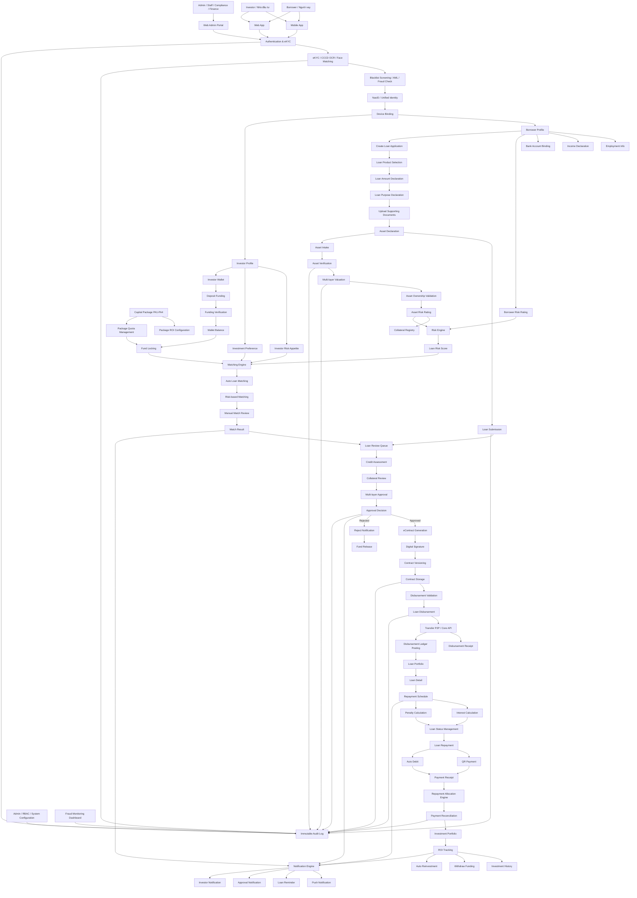
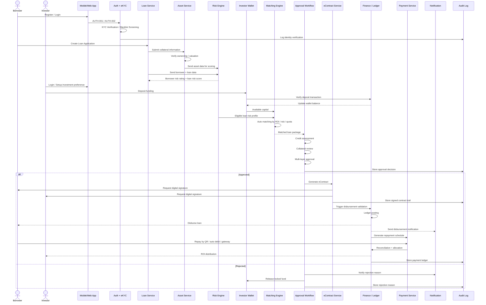
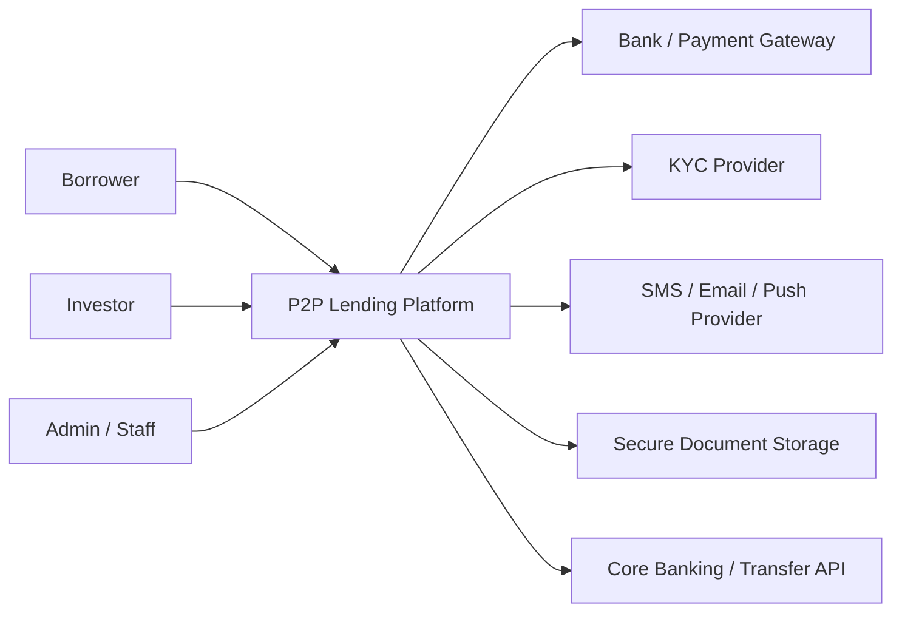
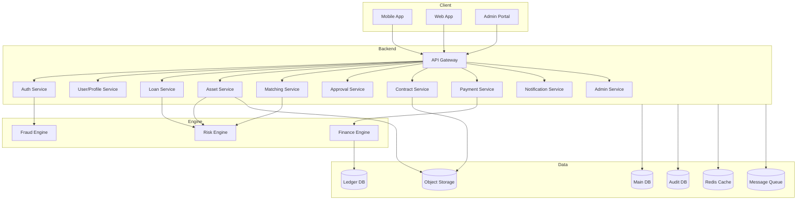
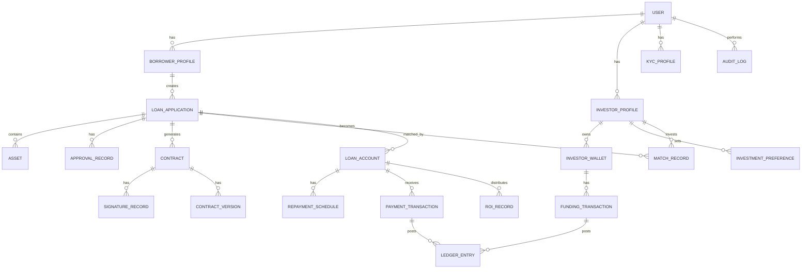
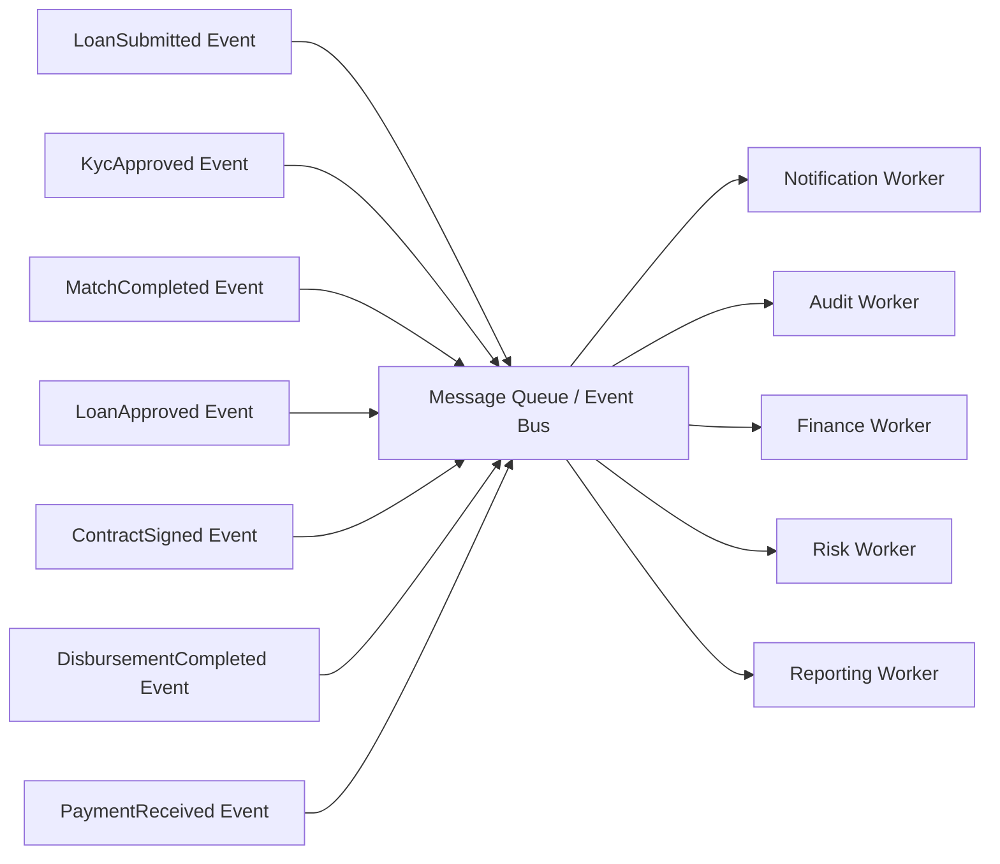

# TÀI LIỆU FLOW HOẠT ĐỘNG TỔNG THỂ HỆ THỐNG P2P LENDING PLATFORM

> Tài liệu này được xây dựng từ Function List của hệ thống, mô tả tổng thể các tác nhân, module nghiệp vụ, luồng xử lý end-to-end, các engine nền, audit/compliance và ghi chú triển khai ở mức Solution Architecture / Business Architecture.

---

# 1. Tổng quan hệ thống

Hệ thống là nền tảng **P2P Lending / Investment Lending Platform**, kết nối giữa:

- **Borrower**: Người có nhu cầu vay vốn.
- **Investor**: Nhà đầu tư cung cấp vốn.
- **Admin / Staff / Compliance / Finance / Risk Team**: Các đội vận hành, kiểm soát, phê duyệt và đối soát.
- **System Engines**: Các engine tự động như Risk Engine, Matching Engine, Finance Engine, Notification Engine.

Mục tiêu chính của hệ thống:

1. Cho phép người vay đăng ký, xác minh danh tính, tạo hồ sơ vay.
2. Cho phép nhà đầu tư đăng ký, xác minh, nạp vốn và thiết lập khẩu vị đầu tư.
3. Tự động đánh giá rủi ro người vay và tài sản bảo đảm.
4. Ghép khoản vay với nguồn vốn phù hợp.
5. Quản lý quy trình phê duyệt nhiều cấp.
6. Sinh hợp đồng điện tử và ký số.
7. Giải ngân khoản vay.
8. Quản lý vòng đời khoản vay, lịch trả nợ, lãi, phí phạt.
9. Phân bổ dòng tiền hoàn trả cho nhà đầu tư.
10. Đảm bảo đầy đủ audit log, compliance, fraud monitoring và kiểm soát tài chính.

---

# 2. Danh sách tác nhân trong hệ thống

| STT | Actor / Role | Mô tả vai trò | Kênh sử dụng |
|---:|---|---|---|
| 1 | Borrower | Người vay vốn, tạo hồ sơ vay, khai báo tài sản, ký hợp đồng, nhận giải ngân, trả nợ | Mobile / Web |
| 2 | Investor | Nhà đầu tư, nạp vốn, chọn khẩu vị đầu tư, theo dõi danh mục và ROI | Mobile / Web |
| 3 | Compliance Officer | Kiểm tra KYC, blacklist, pháp lý, audit, fraud | Web Admin |
| 4 | Credit Officer | Thẩm định tín dụng, đánh giá năng lực trả nợ | Web Admin |
| 5 | Appraiser | Kiểm định, định giá, xác minh tài sản bảo đảm | Web Admin / Mobile |
| 6 | Manager / Approver | Phê duyệt nhiều cấp, quyết định duyệt / từ chối hồ sơ | Web Admin |
| 7 | Finance Team | Xác minh nạp tiền, giải ngân, đối soát thanh toán | Web Admin |
| 8 | Treasury Team | Quản lý gói vốn, quota, liquidity, dòng tiền | Web Admin |
| 9 | Super Admin | Quản trị người dùng, phân quyền, cấu hình hệ thống | Web Admin |
| 10 | Product Team | Cấu hình sản phẩm vay, gói vốn, ROI | Web Admin |
| 11 | Risk Engine | Chấm điểm rủi ro người vay, tài sản, khoản vay | Backend |
| 12 | Matching Engine | Tự động ghép khoản vay với nguồn vốn nhà đầu tư | Backend |
| 13 | Finance Engine | Tính lãi, phí phạt, ledger, phân bổ dòng tiền, ROI | Backend |
| 14 | Notification Engine | Push notification, SMS, email, reminder | Backend |
| 15 | Audit System | Ghi nhận nhật ký bất biến toàn bộ thao tác quan trọng | Backend |

---

# 3. Bản đồ module nghiệp vụ

| Nhóm module | Chức năng chính | Function tiêu biểu |
|---|---|---|
| Authentication | Đăng ký, đăng nhập, KYC, định danh, chống gian lận | AUTH-001 → AUTH-007 |
| Borrower Profile | Quản lý hồ sơ người vay, thu nhập, ngân hàng, scoring | BOR-001 → BOR-006 |
| Investor Profile | Hồ sơ nhà đầu tư, khẩu vị rủi ro, ví đầu tư | INV-001 → INV-005 |
| Capital Package | Quản lý PA1 → PA4, ROI, quota | CAP-001 → CAP-006 |
| Funding | Nạp vốn, xác minh, lock/release vốn | FND-001 → FND-005 |
| Loan Application | Tạo hồ sơ vay, khai báo khoản vay, upload giấy tờ, gửi hồ sơ | LOAN-001 → LOAN-010 |
| Asset Management | Tiếp nhận, xác minh, định giá, quản lý tài sản bảo đảm | AST-001 → AST-008 |
| Matching Engine | Thiết lập điều kiện, auto match, risk match | MTC-001 → MTC-005 |
| Approval Workflow | Review, thẩm định, phê duyệt nhiều cấp, audit | APR-001 → APR-006 |
| eContract | Sinh hợp đồng, ký điện tử, versioning, storage | ECT-001 → ECT-008 |
| Disbursement | Kiểm tra điều kiện, giải ngân, ledger | DIS-001 → DIS-005 |
| Loan Management | Portfolio, lịch trả nợ, tính lãi, trạng thái khoản vay | LMS-001 → LMS-008 |
| Payment | Thanh toán, QR, auto debit, receipt, reconciliation | PAY-001 → PAY-006 |
| Investor Operations | Portfolio, ROI, lịch sử, rút vốn, tái đầu tư | IOP-001 → IOP-005 |
| Notification | Push, reminder, approval notification, investor notification | NTF-001 → NTF-004 |
| Admin | User, RBAC, audit, fraud dashboard, config | ADM-001 → ADM-007 |

---

# 4. Flow tổng thể hệ thống



---

# 5. Sequence Diagram - Luồng end-to-end từ vay vốn đến hoàn trả



---

# 6. Business Flow theo từng giai đoạn

## 6.1 Phase 1 - Authentication & Identity

### Function liên quan

- AUTH-001: Register Account
- AUTH-002: Login System
- AUTH-003: KYC Verification
- AUTH-004: NasID Generation
- AUTH-005: Device Binding
- AUTH-006: eKYC Review Queue
- AUTH-007: Blacklist Screening

### Mục tiêu

Xác thực danh tính người dùng, chống gian lận, đảm bảo mỗi user có định danh duy nhất trong toàn hệ thống.

### Ghi chú chuyên môn

- KYC nên có 2 luồng:
  - **Auto KYC**: OCR CCCD + Face Matching + Liveness.
  - **Manual Review**: Nếu OCR lỗi, ảnh mờ, thông tin không khớp hoặc blacklist warning.
- NasID nên là immutable identity key, không phụ thuộc email/số điện thoại.
- Device Binding giúp phát hiện multi-account, thiết bị rủi ro, fraud pattern.

---

## 6.2 Phase 2 - Borrower Profile

### Function liên quan

- BOR-001: Borrower Profile Management
- BOR-002: Employment Information
- BOR-003: Income Declaration
- BOR-004: Bank Account Binding
- BOR-005: Financial Health Score
- BOR-006: Borrower Risk Rating

### Mục tiêu

Thu thập dữ liệu tài chính, nghề nghiệp, thu nhập, ngân hàng để phục vụ chấm điểm rủi ro.

### Ghi chú chuyên môn

- Income Declaration cần có bằng chứng như sao kê, hợp đồng lao động, bảng lương.
- Bank Account Binding phải xác minh tên tài khoản trùng với KYC.
- Borrower Risk Rating nên được tính theo:
  - Thu nhập
  - Nghề nghiệp
  - Lịch sử giao dịch
  - Lịch sử vay
  - Tài sản bảo đảm
  - Blacklist / fraud score

---

## 6.3 Phase 3 - Investor Profile & Funding

### Function liên quan

- INV-001 → INV-005
- FND-001 → FND-005

### Mục tiêu

Cho phép nhà đầu tư xác minh, nạp vốn, quản lý ví, thiết lập khẩu vị rủi ro và điều kiện đầu tư.

### Ghi chú chuyên môn

- Investor Risk Appetite gồm Low / Medium / High.
- Investment Preference nên có:
  - Lãi suất kỳ vọng
  - Kỳ hạn mong muốn
  - Mức rủi ro chấp nhận
  - Loại tài sản bảo đảm
  - Hạn mức đầu tư mỗi khoản
- Fund Locking rất quan trọng để tránh oversell vốn khi nhiều khoản vay match cùng lúc.
- Funding Verification cần auto reconcile với ngân hàng.

---

## 6.4 Phase 4 - Capital Package

### Function liên quan

- CAP-001: PA1 Package Management
- CAP-002: PA2 Package Management
- CAP-003: PA3 Package Management
- CAP-004: PA4 Package Management
- CAP-005: Package ROI Configuration
- CAP-006: Package Quota Management

### Mục tiêu

Quản lý các gói vốn đầu tư theo mô hình lợi nhuận và rủi ro khác nhau.

### Ghi chú chuyên môn

Gợi ý phân loại:

| Package | Mô hình | Đặc điểm |
|---|---|---|
| PA1 | Fixed Return | Lợi tức cố định |
| PA2 | Flexible Model | Linh hoạt theo khoản vay |
| PA3 | Revenue Share | Chia sẻ doanh thu |
| PA4 | Asset-backed | Có tài sản bảo đảm |

---

## 6.5 Phase 5 - Loan Application

### Function liên quan

- LOAN-001 → LOAN-010

### Mục tiêu

Người vay tạo hồ sơ vay, chọn sản phẩm, khai báo số tiền, mục đích, upload hồ sơ, khai báo tài sản và gửi duyệt.

### Ghi chú chuyên môn

- Loan Draft Saving giúp người vay lưu nháp và tiếp tục sau.
- Loan Submission là điểm kích hoạt workflow thẩm định.
- Loan Withdrawal Request chỉ được phép sau khi khoản vay đã được duyệt và hợp đồng đủ điều kiện giải ngân.

---

## 6.6 Phase 6 - Asset Management

### Function liên quan

- AST-001 → AST-008

### Mục tiêu

Quản lý tài sản bảo đảm từ tiếp nhận, kiểm định, định giá, lưu bằng chứng đến xác minh quyền sở hữu.

### Ghi chú chuyên môn

- Asset Verification cần chống gian lận ảnh, giấy tờ giả, tài sản không tồn tại.
- Multi-layer Valuation nên có ít nhất 2 lớp:
  - Internal Appraiser
  - External Valuation / Market Reference
- Asset Risk Rating cần xem:
  - Thanh khoản tài sản
  - Biến động giá
  - Pháp lý
  - Khả năng thu hồi
  - Tỷ lệ LTV

---

## 6.7 Phase 7 - Matching Engine

### Function liên quan

- MTC-001 → MTC-005

### Mục tiêu

Tự động ghép khoản vay với nguồn vốn nhà đầu tư phù hợp.

### Input

- Loan amount
- Risk score
- Asset rating
- Investor available balance
- Investor risk appetite
- Investment preference
- Package quota
- Expected ROI

### Output

- Match result
- Funding allocation
- Lock fund transaction
- Notification

### Ghi chú chuyên môn

Matching Engine nên có cơ chế:

1. Rule-based matching.
2. Risk-based matching.
3. Quota-based allocation.
4. Manual override.
5. Rollback nếu approval fail.

---

## 6.8 Phase 8 - Approval Workflow

### Function liên quan

- APR-001 → APR-006

### Mục tiêu

Quản lý quy trình thẩm định và phê duyệt khoản vay nhiều cấp.

### Các bước chính

1. Loan Review Queue
2. Credit Assessment
3. Collateral Review
4. Multi-layer Approval
5. Approval Decision
6. Approval Audit Log

### Ghi chú chuyên môn

- Mỗi quyết định approve/reject phải có reason.
- Không cho sửa log phê duyệt.
- Nên có approval matrix theo:
  - Số tiền vay
  - Risk level
  - Loại tài sản
  - Kỳ hạn
  - LTV

---

## 6.9 Phase 9 - eContract

### Function liên quan

- ECT-001 → ECT-008

### Mục tiêu

Sinh hợp đồng điện tử, ký điện tử, lưu trữ, versioning và audit trail.

### Ghi chú chuyên môn

- Contract Generation nên lấy dữ liệu từ:
  - Borrower profile
  - Investor profile
  - Loan terms
  - Asset information
  - ROI / interest / fee
  - Repayment schedule
- Digital Signature có thể dùng OTP signing.
- Contract Versioning bắt buộc để audit khi có thay đổi điều khoản.

---

## 6.10 Phase 10 - Disbursement

### Function liên quan

- DIS-001 → DIS-005

### Mục tiêu

Giải ngân khoản vay sau khi thỏa mãn toàn bộ điều kiện.

### Điều kiện giải ngân

- Hồ sơ đã approve.
- Match vốn thành công.
- Hợp đồng đã ký đủ bên.
- Tài sản bảo đảm hợp lệ.
- Không có cảnh báo compliance.
- Bank account verified.

### Ghi chú chuyên môn

- Disbursement Ledger Posting nên dùng double-entry accounting.
- Transfer P2P cần idempotency key để tránh chuyển tiền trùng.
- Mỗi giao dịch giải ngân phải sinh receipt.

---

## 6.11 Phase 11 - Loan Management

### Function liên quan

- LMS-001 → LMS-008

### Mục tiêu

Quản lý vòng đời khoản vay từ sau giải ngân đến tất toán.

### Trạng thái gợi ý

```text
DRAFT
SUBMITTED
UNDER_REVIEW
MATCHED
APPROVED
CONTRACT_SIGNED
DISBURSED
ACTIVE
OVERDUE
EXTENDED
EARLY_SETTLED
SETTLED
REJECTED
CANCELLED
```

### Ghi chú chuyên môn

- Interest Calculation nên chạy daily accrual.
- Penalty Calculation chạy khi quá hạn.
- Loan Extension cần approval.
- Early Settlement cần tính phí tất toán trước hạn.

---

## 6.12 Phase 12 - Payment & Reconciliation

### Function liên quan

- PAY-001 → PAY-006

### Mục tiêu

Cho phép người vay thanh toán khoản vay, đối soát, phân bổ tiền và ghi nhận ledger.

### Thứ tự phân bổ tiền đề xuất

1. Phí phạt quá hạn
2. Lãi đến hạn
3. Gốc đến hạn
4. Phí khác
5. Dư thừa / trả trước

### Ghi chú chuyên môn

- Payment Reconciliation nên tự động đối soát qua bank transaction reference.
- Auto Debit cần consent rõ ràng từ người vay.
- Payment Receipt cần xuất PDF.

---

## 6.13 Phase 13 - Investor Operations

### Function liên quan

- IOP-001 → IOP-005

### Mục tiêu

Cho phép nhà đầu tư theo dõi danh mục, ROI, lịch sử đầu tư, rút vốn, tái đầu tư.

### Ghi chú chuyên môn

- ROI Tracking nên phân tách:
  - Expected ROI
  - Accrued ROI
  - Realized ROI
  - Overdue impact
- Withdraw Funding cần kiểm tra:
  - Số dư khả dụng
  - Vốn đang lock
  - Vốn đang đầu tư
  - Điều kiện thanh khoản

---

## 6.14 Phase 14 - Notification

### Function liên quan

- NTF-001 → NTF-004

### Mục tiêu

Thông báo realtime cho người vay, nhà đầu tư và đội vận hành.

### Notification event chính

- KYC success / failed
- Loan submitted
- Loan approved / rejected
- Match success
- Contract ready to sign
- Disbursement success
- Repayment reminder
- Payment success
- Overdue warning
- ROI updated

---

## 6.15 Phase 15 - Admin & Governance

### Function liên quan

- ADM-001 → ADM-007

### Mục tiêu

Quản trị hệ thống, phân quyền, audit, fraud dashboard, cấu hình sản phẩm và dòng tiền.

### Ghi chú chuyên môn

- RBAC phải kiểm soát theo role + permission.
- Audit Log nên immutable.
- Fraud Dashboard cần realtime signal.
- System Configuration cần versioning để biết cấu hình nào áp dụng tại thời điểm nào.

---

# 7. C4 Context Diagram



---

# 8. Container Architecture



---

# 9. Domain Model tổng quan



---

# 10. Audit Log bắt buộc

Các hành động cần ghi audit:

| Nhóm | Event cần log |
|---|---|
| Authentication | Register, Login, Logout, Device Binding |
| KYC | Submit KYC, Auto Approved, Manual Review, Rejected |
| Blacklist | Screening result, AML flag, Fraud flag |
| Borrower | Update profile, Update bank account, Submit income |
| Investor | Update risk appetite, Deposit, Withdraw |
| Loan | Create draft, Submit loan, Withdraw request |
| Asset | Intake, Verification, Valuation, Ownership validation |
| Matching | Auto match, Manual override, Fund lock, Fund release |
| Approval | Credit review, Collateral review, Approve, Reject |
| Contract | Generate, Sign, Cancel, Version update |
| Disbursement | Validate, Transfer, Receipt, Ledger posting |
| Payment | Repayment, Allocation, Reconciliation |
| Admin | User CRUD, Role change, Product config, System config |

---

# 11. Ghi chú bảo mật

## 11.1 Identity & Access

- JWT/Auth Session phải có refresh token.
- Admin Portal bắt buộc MFA.
- Role Permission dùng RBAC.
- Các quyền nhạy cảm cần maker-checker.

## 11.2 Financial Security

- Giao dịch tiền cần idempotency key.
- Ledger không được sửa trực tiếp.
- Mọi điều chỉnh tài chính phải bằng reversal transaction.
- Funding / Disbursement / Payment phải có reconciliation.

## 11.3 Compliance

- KYC phải lưu evidence.
- Blacklist screening bắt buộc trước khi duyệt khoản vay.
- Contract audit trail không được sửa.
- Approval decision phải có reason.

## 11.4 Fraud Control

- Device fingerprint.
- Duplicate identity detection.
- Bank account name matching.
- Suspicious funding detection.
- Asset duplicate detection.
- Abnormal repayment behavior.

---

# 12. Non-functional Requirements

| Nhóm | Yêu cầu |
|---|---|
| Security | JWT, MFA, RBAC, encryption, audit log |
| Performance | Cache, async queue, pagination, indexing |
| Scalability | Service-based architecture, horizontal scaling |
| Availability | Retry, circuit breaker, backup, monitoring |
| Compliance | Immutable audit, KYC evidence, approval trail |
| Financial Accuracy | Double-entry ledger, reconciliation, idempotency |
| Maintainability | Modular service, clear domain boundary |
| Observability | Log, metric, trace, alert dashboard |

---

# 13. Event-driven Architecture đề xuất



---

# 14. Trạng thái nghiệp vụ đề xuất

## 14.1 User KYC Status

```text
NOT_STARTED
SUBMITTED
AUTO_VERIFIED
MANUAL_REVIEW
APPROVED
REJECTED
BLACKLISTED
```

## 14.2 Loan Application Status

```text
DRAFT
SUBMITTED
UNDER_REVIEW
RISK_ASSESSED
MATCHING
MATCHED
APPROVED
REJECTED
CONTRACT_GENERATED
SIGNED
DISBURSED
CANCELLED
```

## 14.3 Loan Account Status

```text
ACTIVE
OVERDUE
EXTENDED
EARLY_SETTLED
SETTLED
DEFAULTED
WRITTEN_OFF
```

## 14.4 Funding Status

```text
PENDING
VERIFIED
AVAILABLE
LOCKED
RELEASED
INVESTED
WITHDRAWN
FAILED
```

## 14.5 Contract Status

```text
DRAFT
GENERATED
WAITING_SIGNATURE
SIGNED
ACTIVE
CANCELLED
EXPIRED
```

---

# 15. Kết luận

Hệ thống từ Function List có thể được thiết kế như một nền tảng lending/investment hoàn chỉnh với 5 trục chính:

1. **Identity & Compliance**  
   Định danh, KYC, blacklist, device binding, audit.

2. **Loan Origination**  
   Hồ sơ vay, tài sản bảo đảm, scoring, thẩm định.

3. **Capital & Matching**  
   Nhà đầu tư, gói vốn, ví, lock vốn, auto matching.

4. **Contract & Finance**  
   Hợp đồng điện tử, ký số, giải ngân, ledger, đối soát.

5. **Loan Servicing & Investor ROI**  
   Quản lý khoản vay, thanh toán, tính lãi/phạt, phân bổ ROI.

Với thiết kế này, hệ thống có thể mở rộng theo hướng:

- Microservices
- Event-driven architecture
- Risk-based automation
- Fraud monitoring realtime
- Finance ledger chuẩn double-entry
- Compliance-first architecture
- Mobile-first lending experience
