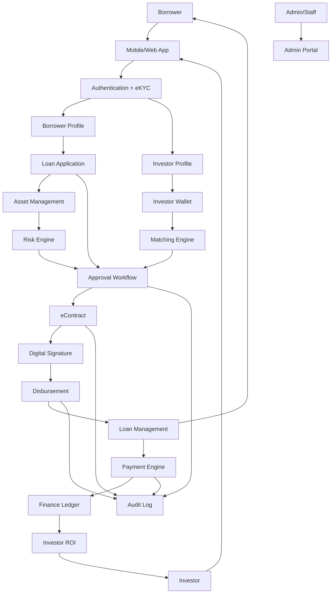

# P2P Lending Platform - System Flow & Architecture

## 1. Tổng quan hệ thống

Hệ thống là nền tảng P2P Lending kết nối Người vay (Borrower) và Nhà đầu tư (Investor) thông qua các quy trình:
- eKYC & Authentication
- Loan Application
- Asset Management
- Risk Scoring
- Matching Engine
- Approval Workflow
- eContract
- Disbursement
- Loan Management
- Payment & ROI
- Audit & Compliance

---

## 2. Các tác nhân (Actors)

| Actor | Vai trò |
|---------|---------|
| Borrower | Người vay vốn |
| Investor | Nhà đầu tư |
| Compliance Officer | Kiểm soát tuân thủ |
| Credit Officer | Thẩm định tín dụng |
| Appraiser | Thẩm định tài sản |
| Finance Team | Giải ngân & đối soát |
| Treasury Team | Quản lý nguồn vốn |
| Admin | Quản trị hệ thống |
| Risk Engine | Chấm điểm rủi ro |
| Matching Engine | Ghép vốn |
| Finance Engine | Ledger, Interest, ROI |
| Notification Engine | Thông báo |
| Audit System | Nhật ký bất biến |

---

## 3. Flow nghiệp vụ tổng thể

---

## 4. Kiến trúc nghiệp vụ

### Layer 1 - Channel Layer

- Mobile App
- Web Portal
- Admin Portal
- API Gateway

### Layer 2 - Business Services

- Authentication Service
- User Service
- Loan Service
- Asset Service
- Contract Service
- Payment Service
- Notification Service

### Layer 3 - Business Engines

#### Risk Engine
- Financial Scoring
- Borrower Rating
- Asset Rating
- Fraud Detection

#### Matching Engine
- Auto Matching
- Risk Matching
- Investment Preference Matching

#### Finance Engine
- Interest Calculation
- Penalty Calculation
- ROI Distribution
- Double Entry Ledger

### Layer 4 - Data Layer

- Main Database
- Audit Database
- Document Storage
- Contract Repository

---

## 5. End-to-End Journey

### Phase 1 - Onboarding

1. Register
2. Login
3. eKYC
4. Device Binding
5. Blacklist Screening

### Phase 2 - Borrower Preparation

1. Hồ sơ cá nhân
2. Nghề nghiệp
3. Thu nhập
4. Tài khoản ngân hàng
5. Chấm điểm tài chính

### Phase 3 - Investor Preparation

1. Hồ sơ đầu tư
2. KYC/KYB
3. Ví đầu tư
4. Khẩu vị rủi ro
5. Điều kiện đầu tư

### Phase 4 - Loan Creation

1. Chọn sản phẩm vay
2. Nhập số tiền vay
3. Khai báo mục đích
4. Upload hồ sơ
5. Khai báo tài sản
6. Gửi hồ sơ

### Phase 5 - Asset Processing

1. Tiếp nhận tài sản
2. Kiểm định
3. Định giá
4. Xác minh sở hữu
5. Chấm điểm rủi ro

### Phase 6 - Matching

1. Lock vốn
2. Matching
3. Risk Matching
4. Notification

### Phase 7 - Approval

1. Credit Review
2. Asset Review
3. Multi-layer Approval
4. Approval Decision
5. Audit Log

### Phase 8 - Contract

1. Generate Contract
2. OTP Signing
3. Versioning
4. Storage

### Phase 9 - Disbursement

1. Validation
2. Transfer
3. Receipt
4. Ledger Posting

### Phase 10 - Loan Lifecycle

1. Repayment Schedule
2. Interest Calculation
3. Penalty Calculation
4. Loan Status Management
5. Extension
6. Settlement

### Phase 11 - Repayment

1. Payment
2. QR Payment
3. Auto Debit
4. Reconciliation
5. Allocation Engine

### Phase 12 - Investor ROI

1. Portfolio
2. ROI Tracking
3. Withdraw
4. Reinvestment

---

## 6. Core Engines

### Risk Engine

Input:
- Income
- Employment
- Credit History
- Asset Value
- Asset Liquidity

Output:
- Borrower Rating
- Asset Rating
- Fraud Risk

### Matching Engine

Input:
- Investor Preference
- Risk Profile
- Available Capital

Output:
- Matching Proposal
- Fund Allocation

### Finance Engine

Input:
- Loan
- Repayment
- Interest

Output:
- Ledger Entry
- ROI Distribution
- Financial Statement

---

## 7. Audit & Compliance

Bắt buộc ghi log cho:

- Authentication
- KYC
- Approval
- Contract
- Disbursement
- Payment
- Admin Actions

Nguyên tắc:

- Immutable Log
- Non Editable
- Full Traceability
- Compliance Ready

---

## 8. Kết luận

Đây là kiến trúc Enterprise P2P Lending Platform với đầy đủ:

- Identity & eKYC
- Loan Origination
- Collateral Management
- Risk Assessment
- Capital Matching
- Approval Workflow
- Digital Contract
- Disbursement
- Loan Servicing
- Repayment Management
- Investor ROI Management
- Compliance & Audit
