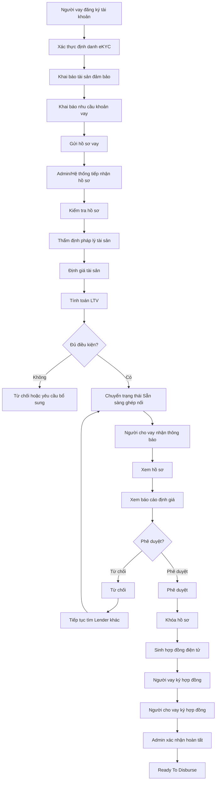
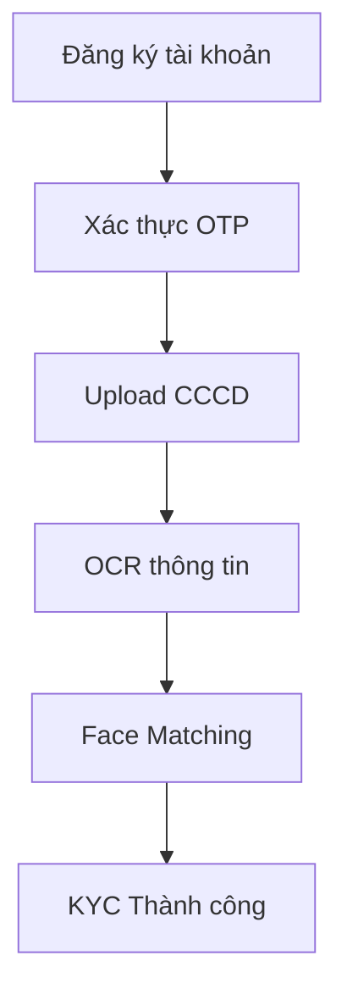
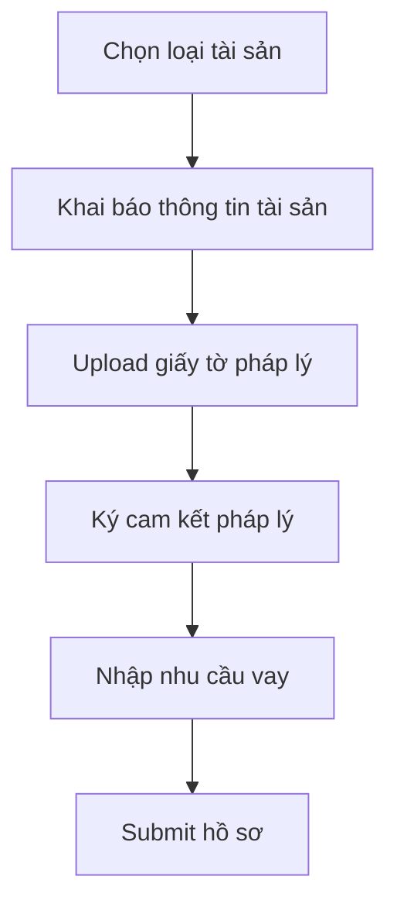
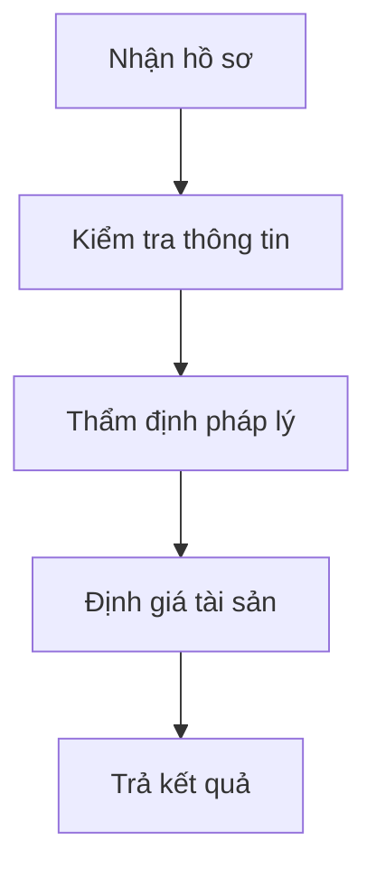
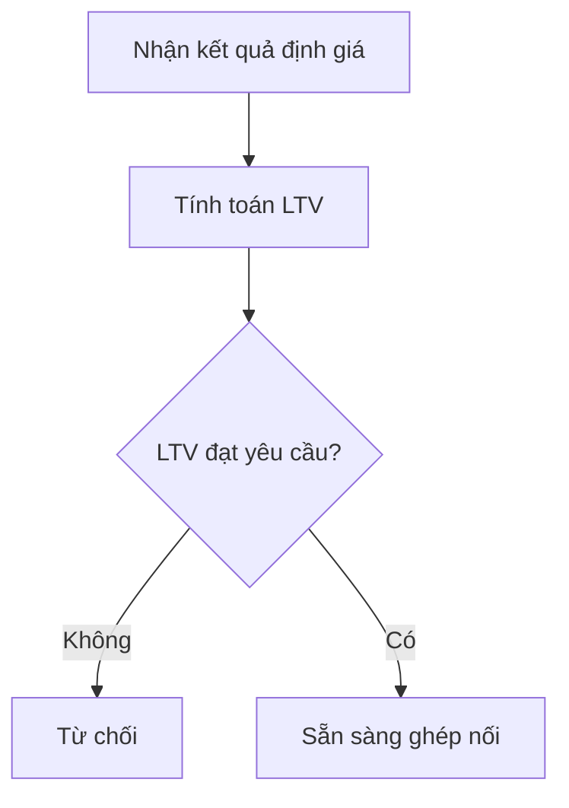
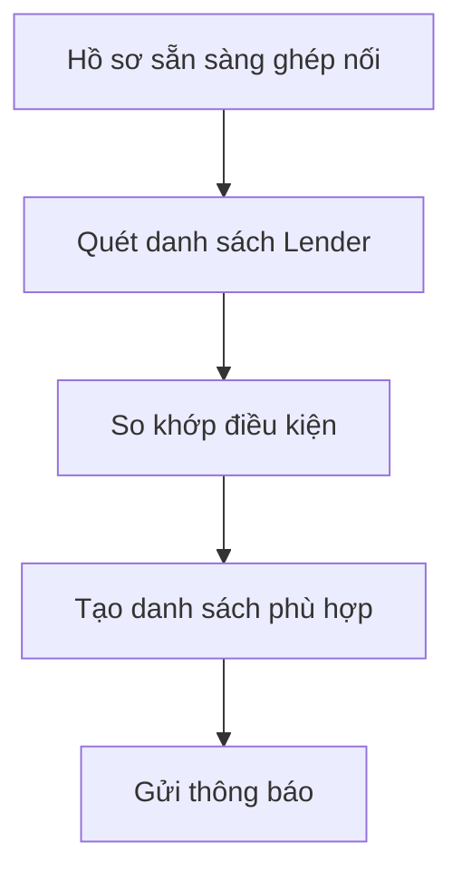
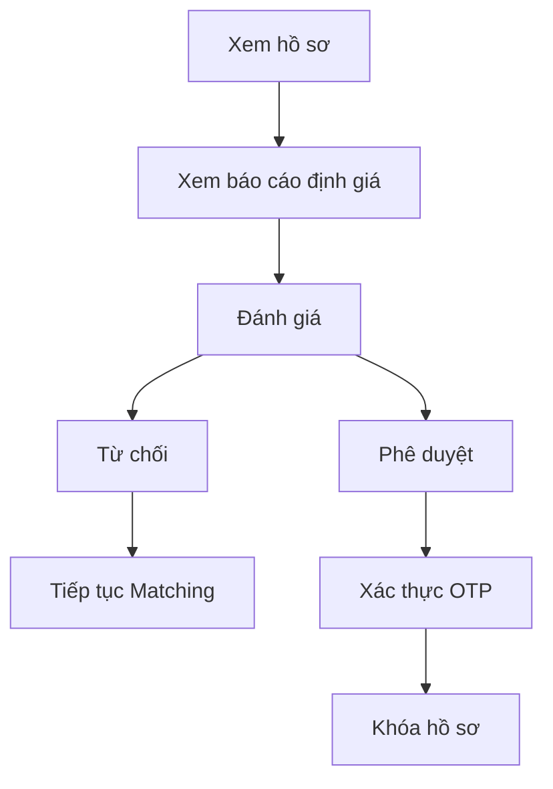
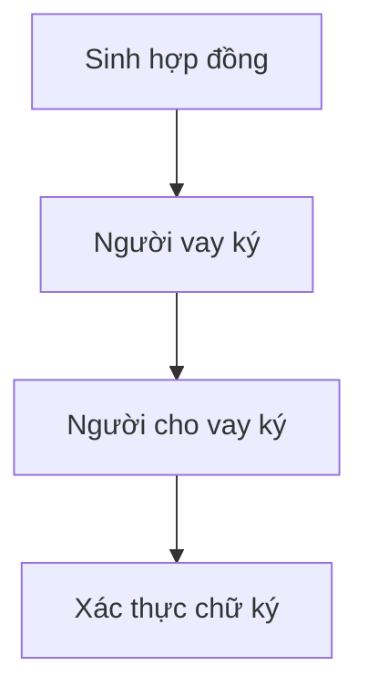
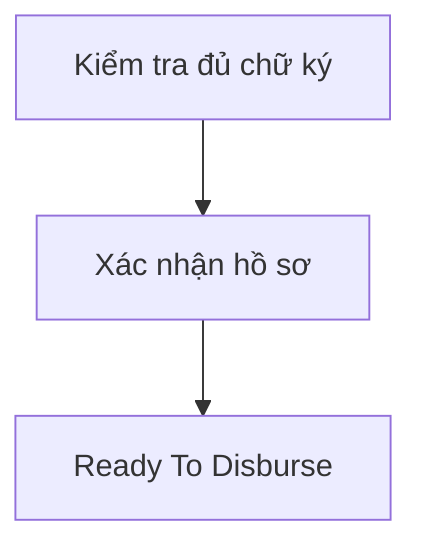
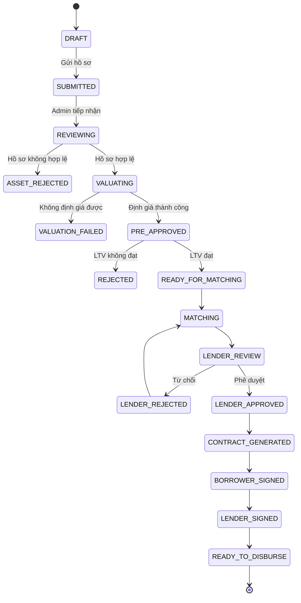

# FLOW NGHIỆP VỤ TỔNG QUAN HỆ THỐNG P2P LENDING

## 1. Mục tiêu

Hệ thống P2P Lending là nền tảng kết nối giữa **Người vay (Borrower)** và **Người cho vay (Lender)** thông qua quy trình số hóa từ đăng ký hồ sơ, xác thực danh tính, thẩm định tài sản, ghép nối nguồn vốn, ký kết hợp đồng điện tử đến trạng thái sẵn sàng giải ngân.

Phạm vi tài liệu này bao gồm:

* Quản lý hồ sơ vay.
* Thẩm định tài sản.
* Ghép nối Borrower và Lender.
* Ký hợp đồng điện tử.
* Chuyển trạng thái chờ giải ngân.

---

# 2. Các tác nhân chính

| Tác nhân               | Vai trò                                                                          |
| ---------------------- | -------------------------------------------------------------------------------- |
| Người vay (Borrower)   | Đăng ký tài khoản, khai báo hồ sơ vay, cung cấp tài sản bảo đảm, ký hợp đồng     |
| Người cho vay (Lender) | Thiết lập điều kiện cấp vốn, đánh giá hồ sơ, phê duyệt hoặc từ chối khoản vay    |
| Admin Hệ thống         | Quản lý vận hành, giám sát quy trình thẩm định, xử lý ngoại lệ và xác nhận hồ sơ |

---

# 3. Business Flow Tổng Quan

---

# 4. Flow Theo Từng Giai Đoạn

## Giai đoạn 1: Đăng ký và xác thực Người vay

### Mục tiêu

Cho phép người vay tạo tài khoản và xác thực danh tính trước khi sử dụng dịch vụ.

### Use Case

* US-BRW-01
* US-BRW-02
* US-BRW-03

### Flow

### Kết quả

* Tài khoản được kích hoạt.
* Người vay đủ điều kiện tạo hồ sơ vay.

---

## Giai đoạn 2: Khởi tạo hồ sơ vay

### Mục tiêu

Thu thập tài sản bảo đảm và nhu cầu vay vốn.

### Use Case

* US-BRW-04
* US-BRW-05
* US-BRW-2.02
* US-BRW-2.03
* US-BRW-2.04

### Flow

### Kết quả

* Hồ sơ vay được gửi đến hệ thống.

---

## Giai đoạn 3: Thẩm định hồ sơ

### Mục tiêu

Kiểm tra tính hợp pháp của tài sản và xác định giá trị định giá.

### Use Case

* US-SYS-3.01
* US-SYS-3.02
* US-SYS-3.03
* US-SYS-3.04

### Flow

### Kết quả

* Tài sản hợp lệ hoặc không hợp lệ.
* Có giá trị định giá chính thức.

---

## Giai đoạn 4: Phê duyệt sơ bộ

### Mục tiêu

Đánh giá khả năng vay vốn dựa trên giá trị tài sản.

### Use Case

* US-SYS-4.01
* US-BRW-06

### Flow

### Kết quả

* Hồ sơ được phê duyệt sơ bộ.
* Hoặc bị từ chối.

---

## Giai đoạn 5: Matching Người cho vay

### Mục tiêu

Tìm kiếm Người cho vay phù hợp với điều kiện khoản vay.

### Use Case

* US-SYS-4.02
* US-SYS-4.03
* US-LND-5.01
* US-LND-5.02
* US-LND-5.03
* US-LND-5.04
* US-LND-5.05

### Flow

### Điều kiện Matching

* Hạn mức cấp vốn.
* Loại tài sản.
* Mức lãi suất.
* Kỳ hạn vay.
* Trạng thái nhận hồ sơ.

---

## Giai đoạn 6: Đánh giá hồ sơ bởi Người cho vay

### Mục tiêu

Người cho vay quyết định cấp vốn hoặc từ chối hồ sơ.

### Use Case

* US-LND-6.01
* US-LND-6.02
* US-LND-6.03
* US-LND-6.04

### Flow

### Kết quả

* Hồ sơ tiếp tục ghép nối.
* Hoặc được phê duyệt bởi một Lender.

---

## Giai đoạn 7: Giao kết hợp đồng

### Mục tiêu

Hoàn tất thủ tục pháp lý giữa các bên.

### Use Case

* US-CON-7.01
* US-CON-7.02
* US-CON-7.03

### Flow

### Kết quả

* Hợp đồng điện tử có hiệu lực.

---

## Giai đoạn 8: Chờ giải ngân

### Mục tiêu

Chuyển hồ sơ sang trạng thái sẵn sàng giải ngân.

### Use Case

* US-CON-7.04
* US-BRW-07

### Flow

### Kết quả

* Khoản vay đủ điều kiện giải ngân.

---

# 5. State Flow Hồ Sơ Vay

---

# 6. Ngoại lệ nghiệp vụ

| Trường hợp                    | Xử lý             |
| ----------------------------- | ----------------- |
| Người vay hủy hồ sơ           | CANCELLED         |
| Hồ sơ thiếu thông tin         | Yêu cầu bổ sung   |
| Tài sản không hợp lệ          | ASSET_REJECTED    |
| Định giá thất bại             | VALUATION_FAILED  |
| LTV không đạt                 | REJECTED          |
| Không tìm được Lender phù hợp | MATCH_EXPIRED     |
| Lender từ chối                | Quay lại MATCHING |
| Hợp đồng hết hạn ký           | CONTRACT_EXPIRED  |

---
