# FLOW HOẠT ĐỘNG TỔNG THỂ HỆ THỐNG P2P LENDING

## 1. Tổng quan hệ thống

Hệ thống P2P Lending là nền tảng kết nối giữa **Người vay** và **Nhà đầu tư**, cho phép xử lý toàn bộ vòng đời khoản vay từ đăng ký, xác minh danh tính, tạo hồ sơ vay, thẩm định, ghép vốn, ký hợp đồng, giải ngân, quản lý khoản vay, thanh toán và phân bổ lợi nhuận cho nhà đầu tư.

Mục tiêu của hệ thống:

- Số hóa toàn bộ quy trình vay và đầu tư.
- Tự động hóa thẩm định, matching và kiểm soát rủi ro.
- Minh bạch dòng tiền giữa người vay, nhà đầu tư và hệ thống.
- Đảm bảo đầy đủ kiểm soát vận hành, audit log và compliance.
- Hỗ trợ mở rộng theo mô hình nhiều sản phẩm vay, nhiều gói vốn và nhiều cấp phê duyệt.

---

## 2. Các tác nhân trong hệ thống

| Tác nhân | Vai trò chính | Kênh sử dụng |
|---|---|---|
| Borrower / Người vay | Đăng ký, KYC, tạo hồ sơ vay, khai báo tài sản, ký hợp đồng, nhận giải ngân, trả nợ | Mobile/Web |
| Investor / Nhà đầu tư | Đăng ký, xác minh, nạp vốn, chọn khẩu vị đầu tư, theo dõi ROI, rút vốn | Mobile/Web |
| Compliance/Admin | Kiểm tra KYC, blacklist, fraud, audit, pháp lý | Web Admin |
| Credit Officer | Thẩm định tín dụng, đánh giá hồ sơ vay | Web Admin |
| Appraiser | Kiểm định và định giá tài sản bảo đảm | Web Admin/Mobile |
| Manager/Approver | Phê duyệt nhiều cấp, duyệt/từ chối hồ sơ | Web Admin |
| Finance Team | Xác minh nạp tiền, giải ngân, đối soát thanh toán | Web Admin |
| Treasury Team | Quản lý gói vốn, hạn mức vốn, dòng tiền | Web Admin |
| Super Admin | Quản lý người dùng, phân quyền, cấu hình hệ thống | Web Admin |
| Risk Engine | Chấm điểm rủi ro người vay, khoản vay và tài sản | Backend |
| Matching Engine | Ghép khoản vay với nhà đầu tư phù hợp | Backend |
| Finance Engine | Tính lãi, phí phạt, ledger, ROI | Backend |
| Notification Engine | Gửi thông báo realtime, SMS, email, push | Backend |
| Audit System | Ghi nhận nhật ký bất biến toàn bộ thao tác quan trọng | Backend |

---

## 3. Nhóm chức năng chính

| Nhóm chức năng | Mục đích |
|---|---|
| Authentication & eKYC | Đăng ký, đăng nhập, xác minh CCCD, face matching, blacklist |
| Borrower Profile | Quản lý hồ sơ người vay, nghề nghiệp, thu nhập, tài khoản ngân hàng |
| Investor Profile | Quản lý hồ sơ nhà đầu tư, ví đầu tư, khẩu vị rủi ro |
| Capital Package | Quản lý các gói vốn PA1, PA2, PA3, PA4, ROI và quota |
| Funding | Nạp vốn, xác minh giao dịch, khóa vốn, hoàn vốn |
| Loan Application | Tạo hồ sơ vay, khai báo khoản vay, upload giấy tờ, gửi duyệt |
| Asset Management | Tiếp nhận, xác minh, định giá và quản lý tài sản bảo đảm |
| Matching Engine | Tự động ghép khoản vay với nguồn vốn phù hợp |
| Approval Workflow | Thẩm định, phê duyệt nhiều cấp, lưu audit log |
| eContract | Sinh hợp đồng, ký điện tử, lưu trữ, quản lý version |
| Disbursement | Kiểm tra điều kiện và giải ngân khoản vay |
| Loan Management | Quản lý khoản vay, lịch trả nợ, lãi, phí phạt, trạng thái |
| Payment | Thanh toán, QR, auto debit, đối soát, phân bổ dòng tiền |
| Investor Operations | Theo dõi danh mục đầu tư, ROI, lịch sử, rút vốn, tái đầu tư |
| Notification | Gửi thông báo cho người vay, nhà đầu tư và đội vận hành |
| Admin | Quản trị người dùng, phân quyền, audit, fraud dashboard, cấu hình |

---

## 4. Flow tổng thể hệ thống

```mermaid
flowchart TD
    Borrower["Người vay / Borrower"]
    Investor["Nhà đầu tư / Investor"]
    Admin["Admin / Compliance / Finance / Staff"]

    Mobile["Mobile App"]
    Web["Web App"]
    AdminPortal["Web Admin Portal"]

    Borrower --> Mobile
    Borrower --> Web
    Investor --> Mobile
    Investor --> Web
    Admin --> AdminPortal

    Mobile --> Auth["Authentication & eKYC"]
    Web --> Auth
    AdminPortal --> Auth

    Auth --> KYC["KYC Verification"]
    KYC --> Blacklist["Blacklist Screening"]
    Blacklist --> Identity["NasID / Unified Identity"]
    Identity --> Device["Device Binding"]

    Device --> BorrowerProfile["Borrower Profile"]
    Device --> InvestorProfile["Investor Profile"]

    BorrowerProfile --> Income["Income / Employment / Bank Account"]
    Income --> BorrowerRisk["Borrower Risk Rating"]

    InvestorProfile --> InvestorWallet["Investor Wallet"]
    InvestorProfile --> RiskAppetite["Risk Appetite"]
    InvestorProfile --> InvestmentPreference["Investment Preference"]

    InvestorWallet --> Funding["Deposit Funding"]
    Funding --> FundingVerify["Funding Verification"]
    FundingVerify --> WalletBalance["Wallet Balance"]
    WalletBalance --> FundLocking["Fund Locking"]

    BorrowerProfile --> LoanApplication["Loan Application"]
    LoanApplication --> LoanProduct["Loan Product Selection"]
    LoanProduct --> LoanAmount["Loan Amount Declaration"]
    LoanAmount --> LoanPurpose["Loan Purpose Declaration"]
    LoanPurpose --> UploadDocs["Upload Supporting Documents"]
    UploadDocs --> AssetDeclaration["Asset Declaration"]
    AssetDeclaration --> LoanSubmission["Loan Submission"]

    AssetDeclaration --> AssetIntake["Asset Intake"]
    AssetIntake --> AssetVerification["Asset Verification"]
    AssetVerification --> AssetValuation["Multi-layer Valuation"]
    AssetValuation --> OwnershipValidation["Ownership Validation"]
    OwnershipValidation --> AssetRisk["Asset Risk Rating"]

    BorrowerRisk --> RiskEngine["Risk Engine"]
    AssetRisk --> RiskEngine
    LoanSubmission --> RiskEngine

    RiskEngine --> LoanRiskScore["Loan Risk Score"]

    LoanRiskScore --> MatchingEngine["Matching Engine"]
    FundLocking --> MatchingEngine
    RiskAppetite --> MatchingEngine
    InvestmentPreference --> MatchingEngine

    MatchingEngine --> AutoMatching["Auto Loan Matching"]
    AutoMatching --> RiskBasedMatching["Risk-based Matching"]
    RiskBasedMatching --> MatchResult["Match Result"]

    MatchResult --> ApprovalQueue["Loan Review Queue"]
    LoanSubmission --> ApprovalQueue

    ApprovalQueue --> CreditAssessment["Credit Assessment"]
    CreditAssessment --> CollateralReview["Collateral Review"]
    CollateralReview --> MultiApproval["Multi-layer Approval"]
    MultiApproval --> ApprovalDecision["Approval Decision"]

    ApprovalDecision -->|Approved| ContractGeneration["eContract Generation"]
    ApprovalDecision -->|Rejected| RejectNotification["Reject Notification"]

    RejectNotification --> FundRelease["Fund Release"]

    ContractGeneration --> DigitalSignature["Digital Signature"]
    DigitalSignature --> ContractStorage["Contract Storage"]
    ContractStorage --> DisbursementValidation["Disbursement Validation"]

    DisbursementValidation --> LoanDisbursement["Loan Disbursement"]
    LoanDisbursement --> TransferP2P["Transfer P2P / Core API"]
    TransferP2P --> DisbursementReceipt["Disbursement Receipt"]
    TransferP2P --> LedgerPosting["Ledger Posting"]

    LedgerPosting --> LoanManagement["Loan Management"]
    LoanManagement --> RepaymentSchedule["Repayment Schedule"]
    RepaymentSchedule --> InterestCalculation["Interest Calculation"]
    RepaymentSchedule --> PenaltyCalculation["Penalty Calculation"]
    InterestCalculation --> LoanStatus["Loan Status Management"]
    PenaltyCalculation --> LoanStatus

    LoanStatus --> Payment["Loan Repayment"]
    Payment --> QRPayment["QR Payment"]
    Payment --> AutoDebit["Auto Debit"]
    QRPayment --> PaymentReceipt["Payment Receipt"]
    AutoDebit --> PaymentReceipt

    PaymentReceipt --> Allocation["Repayment Allocation Engine"]
    Allocation --> Reconciliation["Payment Reconciliation"]
    Reconciliation --> InvestorPortfolio["Investment Portfolio"]
    InvestorPortfolio --> ROITracking["ROI Tracking"]
    ROITracking --> WithdrawFunding["Withdraw Funding"]
    ROITracking --> AutoReinvestment["Auto Reinvestment"]

    Notification["Notification Engine"]
    ApprovalDecision --> Notification
    MatchResult --> Notification
    RepaymentSchedule --> Notification
    ROITracking --> Notification

    AuditLog["Immutable Audit Log"]
    Auth --> AuditLog
    KYC --> AuditLog
    LoanSubmission --> AuditLog
    AssetVerification --> AuditLog
    ApprovalDecision --> AuditLog
    DigitalSignature --> AuditLog
    LoanDisbursement --> AuditLog
    PaymentReceipt --> AuditLog
    Reconciliation --> AuditLog
```

